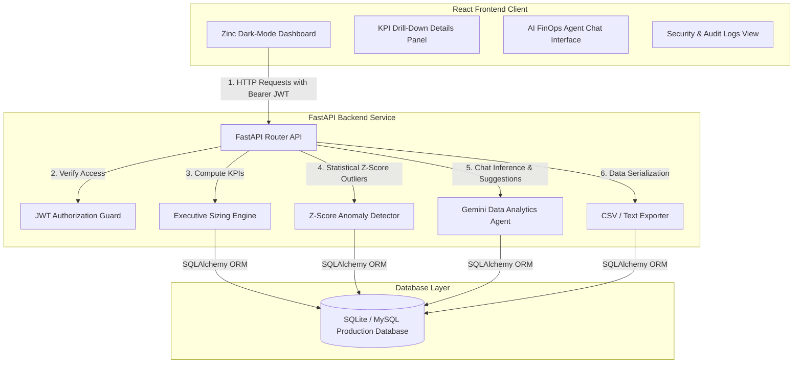

# AetherFin GPU Ops: System Architecture & Data Flow

This document details the system design, components, and data flow of the AetherFin platform.

---

## 📐 System Architecture Diagram

---

## 🔄 Component Responsibility Matrix

### 1. React Frontend Client
- **Tech Stack**: React 18, Vite, ECharts (for SVG/Canvas visualization), Lucide React.
- **Role**: Provides the executive visual layer. Implements Glassmorphism-Zinc Dark Mode styling. Manages active views (Dashboard, Executive Summary, Anomaly Logs, Case Study, and Security Portal).
- **Security**: Stores and passes the JWT bearer token in header authorization headers for restricted endpoints.

### 2. FastAPI Backend Service
- **Tech Stack**: FastAPI, Uvicorn, PyJWT, NumPy, Pydantic.
- **Role**: Serves JSON REST APIs.
- **Sub-Services**:
  - **Auth Guard**: Validates JWTs, resolves user identities, and enforces Role-Based Access Control (RBAC) (e.g., locking audit logs to the `Admin` role).
  - **Sizing Engine**: Calculates GICP, MCES, SLA-VEI, and COROI. Includes database optimizations to prevent N+1 query loops.
  - **Anomaly Detector**: Applies NumPy-based Z-score algorithms ($Z = \frac{x - \mu}{\sigma}$) to detect latency spikes, idle waste nodes, SLA failures, and thermal/power anomalies.
  - **AI Advisor**: Serves chat queries using Gemini API or consulting fallbacks to provide actionable cost saving proposals.
  - **Exporter**: Compiles database logs into downloadable CSV and markdown reports.

### 3. Database Layer
- **Tech Stack**: SQLAlchemy, SQLite (Development), MySQL (Production).
- **Role**: Stores tables with primary/foreign key integrity, logging GPU cluster nodes, active model deployments, hourly metric snapshots, and user access records.
